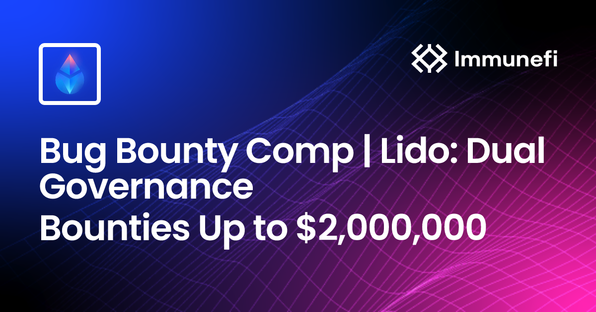

### From Bug to Breakthrough: Lessons from My Web3 Security Research Journey

As a Web3 security researcher, my mission is to help build a more resilient decentralized world. I believe that true security goes beyond simple code audits; it requires a deep understanding of a protocol's architecture, economic design, and a strong adversarial mindset. My recent deep dive into the Lido Dual Governance and Escrow mechanism was a masterclass in this philosophy. While some of my findings were ultimately deemed out-of-scope or acceptable risks, the process of discovering and reporting them provided invaluable lessons that sharpened my skills as a security professional.

This article details my journey through five vulnerabilities I found, focusing on the problem-solving process, my thought patterns as a white-hat hacker, and the crucial lessons I learned along the way.

---

#### 1. Malicious Governance Configuration: The Importance of Resilient Design

- **The Bug**: I discovered that a compromised governance could permanently freeze all user funds in the `Escrow.sol` contract during the RageQuit process. By setting a key parameter in an external `WithdrawalQueue.sol` contract to a near-zero value, a functional deadlock would occur - Malicious Configuration of WithdrawalQueue Leads to Permanent Fund Lock in Escrow Contract.md]. This would cause the withdrawal function to consistently revert, trapping all funds - Malicious Configuration of WithdrawalQueue Leads to Permanent Fund Lock in Escrow Contract.md].
- **Lesson Learned**: This experience reinforced the principle of **defensive programming**. While the scenario relied on a compromised governance, which was deemed out of scope, it highlighted the need for protocols to be resilient not only in their own logic but also against the potential misconfiguration or malicious actions of their dependencies. True security means anticipating and mitigating risks from all possible angles.

---

#### 2. Precision Loss Exploitation: New Exploits for Old Flaws

- **The Bug**: I found a way to exploit a "1-2 wei corner case" in the `requestNextWithdrawalsBatch` function to prematurely and permanently close the withdrawal queue. By depositing a crafted amount, an unprivileged attacker could ensure that a portion of another user's funds would become irrecoverable "dust," causing a permanent fund lock - Precision Loss in calcRequestAmounts Can Be Exploited to Permanently Freeze User Funds in Escrow.md].
- **Lesson Learned**: This case was a masterclass in understanding the difference between a new flaw and a new exploit for an old, accepted flaw - Precision Loss in calcRequestAmounts Can Be Exploited to Permanently Freeze User Funds in Escrow.md]. The root cause was a known integer-division rounding error documented by Lido. My report, while demonstrating a novel attack vector, was ultimately rejected because the core issue was a "known and accepted" characteristic of the protocol - Precision Loss in calcRequestAmounts Can Be Exploited to Permanently Freeze User Funds in Escrow.md].

---

#### 3. Re-Entrancy-Like Double Spend: Impact Assessment is Everything

- **The Bug**: I identified a state management flaw in the `Escrow` contract that could allow an attacker to "double spend" an `unstETH` NFT. The attacker could lock and withdraw an NFT, and the protocol's accounting would still treat it as a finalized asset. This would create a permanent deficit in the protocol's ledger, leading to insolvency - Protocol Insolvency via Re-Entrancy-Like Double Spend in Escrow Contract.md].
- **Lesson Learned**: The Lido team's response taught me that assessing the **true impact** of a vulnerability is as critical as finding it. While my technical finding was valid, the team pointed out that their internal accounting logic in another part of the contract effectively mitigated the "double-spend" risk - Protocol Insolvency via Re-Entrancy-Like Double Spend in Escrow Contract.md]. A technical flaw without a real, exploitable economic consequence is not a critical vulnerability.

---

#### 4. Griefing Attack via Lock Timer Reset: The Nuance of Business Risk

- **The Bug**: I discovered a way for an attacker to maliciously reset a victim's asset lock timer in the `Escrow.sol` contract without locking any new assets. This was a griefing attack that caused a temporary denial of service, preventing a targeted user from withdrawing their funds once their lock period expired - Griefing Attack by Abusing Lock Timer Reset.md].
- **Lesson Learned**: This finding was a crucial lesson in **business risk assessment**. The Lido team classified it as an "Acceptable Risk," noting that the attack had a non-trivial gas cost for the attacker and yielded no financial profit - Griefing Attack by Abusing Lock Timer Reset.md]. The severity of a bug is a practical calculation of its impact, the attacker's incentive, and the cost to exploit versus the damage inflicted.

---

#### 5. "Bug vs. Feature" Debate: The Role of Business Logic

- **The Bug**: I identified that the `calcRequestAmounts` function used a "divide-before-multiply" pattern, leading to precision loss and the permanent discard of "dust" amounts - Potential Loss of Funds Due to Precision Loss in calcRequestAmounts.md]. From a technical standpoint, any loss of user funds, however small, is a flaw - Potential Loss of Funds Due to Precision Loss in calcRequestAmounts.md].
- **Lesson Learned**: This finding taught me a valuable lesson in the "bug vs. intended feature" debate. The Lido team clarified that the function's purpose was solely to calculate the number of _full_ batches, and the leftover dust was an "acceptable and intended precision loss" from a business logic perspective - Potential Loss of Funds Due to Precision Loss in calcRequestAmounts.md]. I learned that in the world of bug bounties, a project's business logic can be the ultimate arbiter of what constitutes a valid vulnerability.

---

#### Conclusion: Beyond the Code

My research into the Lido Dual Governance mechanism was a pivotal moment in my bug bounty journey. While all of my findings were ultimately not paid out, they were not a failure; they were a profound success in learning. My experience solidified my expertise in:

- **Smart Contract Auditing**: Deeply analyzing Solidity code for logic flaws, re-entrancy, and state management issues.
- **DeFi Security**: Understanding the economic and financial implications of technical vulnerabilities.
- **Testing and Verification**: Using tools like Foundry to create comprehensive and runnable Proof-of-Concepts.
- **Technical Communication**: Articulating complex flaws and their impacts in clear, professional reports.

These experiences have refined my ability to think critically, evaluate risks from both a technical and business perspective, and communicate effectively with development teams. I am confident that these skills will be invaluable in a professional security role, and I am excited to continue contributing to the security and resilience of the Web3 ecosystem.
