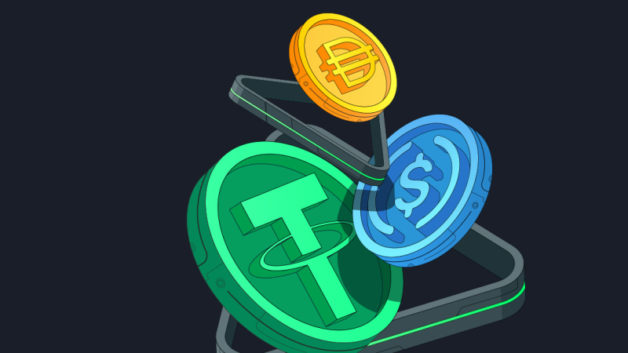

Decentralized Finance (DeFi) has opened up a world of possibilities, and at its core lies the need for stability in a volatile market. Stablecoins are the bedrock of this new financial landscape, providing a reliable medium of exchange and store of value. While many stablecoins exist, building one from the ground up is an incredible learning experience that reveals the intricate mechanics of DeFi protocols.

In this post, I'll walk you through my journey of creating the DeFi Stablecoin project, a decentralized stablecoin pegged to the US Dollar. We'll explore the architecture, the technical challenges I faced, and the solutions I implemented. Whether you're a seasoned Solidity developer or just starting, I hope this deep dive offers valuable insights.

## Project Overview

The goal of the DeFi Stablecoin project was to create a crypto-collateralized, decentralized stablecoin called DSC. The core idea is simple: users can deposit volatile assets like ETH and BTC as collateral to mint DSC tokens, which are designed to maintain a 1:1 peg with the US Dollar.

The system is built on a principle of **overcollateralization**. This means that the value of the collateral held in the system must always be greater than the value of the DSC tokens that have been minted. This is crucial for maintaining the peg and ensuring the system's solvency.

Key features of the project include:

- **Collateralized Debt Positions (CDPs):** Users lock up approved collateral to mint DSC.
- **Health Factor:** Each user's position has a "health factor" that reflects the ratio of their collateral's value to their minted debt. If this factor falls below a certain threshold, their position is at risk of liquidation.
- **Liquidation:** To protect the system, undercollateralized positions can be liquidated by other users, who are incentivized with a bonus.
- **Chainlink Price Feeds:** The system relies on Chainlink's decentralized oracles for accurate, real-time price data of the collateral assets.

The project is built with Solidity for the smart contracts, Foundry as the development and testing framework, and leverages OpenZeppelin's battle-tested contracts for security.

## Smart Contract Architecture

The system is comprised of three main contracts, each with a specific role:

### `DecentralizedStableCoin.sol`

This is the ERC20 token contract for our stablecoin, DSC. It's a standard `ERC20Burnable` token from OpenZeppelin, which means tokens can be minted and burned. A critical design choice was to make it `Ownable`, with the ownership transferred to the `DSCEngine` contract upon deployment. This ensures that only the core engine can create or destroy DSC tokens, preventing unauthorized minting.

### `DSCEngine.sol`

This is the heart of the system. The `DSCEngine` contract handles all the core logic. Its responsibilities include:

- Managing collateral deposits and withdrawals.
- Minting new DSC tokens against collateral.
- Burning DSC tokens when a user redeems their collateral.
- Calculating the health factor of a user's position.
- Handling the liquidation process for undercollateralized positions.

### `OracleLib.sol`

A simple but crucial library for interacting with Chainlink price feeds. Its primary function is to check for "stale" prices. If a price feed hasn't been updated within a specified timeout period (3 hours in this case), the library will revert the transaction. This is a deliberate safety measure to freeze the system and prevent it from operating on outdated, and therefore potentially inaccurate, price information.

## Development Challenges and Solutions

Building this project was not without its hurdles. Here are some of the key challenges and how I tackled them:

### 1. Ensuring Collateral Health and Preventing Insolvency

The biggest challenge in any stablecoin project is maintaining solvency. If the value of the collateral drops below the value of the minted stablecoins, the peg can break.

- **Problem:** How do you ensure that every user's position remains overcollateralized?
- **Solution:** The concept of a "health factor." I created a function, `_calculateHealthFactor`, that takes the user's total minted DSC and the USD value of their collateral as input. The system enforces a `LIQUIDATION_THRESHOLD` of 50%, meaning the collateral value must be at least 150% of the minted DSC value. An internal function, `_revertIfHealthFactorIsBroken`, is called in every function that could alter a user's health factor, like `mintDsc` and `redeemCollateral`. This function reverts the transaction if the health factor falls below the minimum threshold.
- **Health Factor = (Total Collateral Value \* Weighted Average Liquidation Threshold) / Total Borrow Value**

### 2. Handling Price Feeds and Oracle Security

Accurate price data is non-negotiable for a stablecoin. Using unreliable or stale data could lead to catastrophic failure.

- **Problem:** How do you protect against stale or manipulated price feeds?
- **Solution:** As mentioned earlier, I created the `OracleLib.sol` library. This library includes a `staleCheckLatestRoundData` function that wraps Chainlink's `latestRoundData` function. It checks the `updatedAt` timestamp of the price feed and reverts if the data is older than a predefined `TIMEOUT`. While freezing the protocol may seem drastic, it's a far better alternative than allowing it to operate with potentially dangerous data.

### 3. Incentivizing Liquidations

A robust liquidation mechanism is essential for a healthy stablecoin. Without it, undercollateralized positions would linger, putting the entire system at risk.

- **Problem:** Why would someone spend their gas and capital to liquidate another user's position?
- **Solution:** A `LIQUIDATION_BONUS`. When a liquidator repays a portion of the unhealthy debt, they receive the underlying collateral plus a 10% bonus. This creates a clear financial incentive for third parties to monitor the system and liquidate risky positions, effectively crowdsourcing the system's stability.

It's worth noting a limitation of this simplified model: if the collateral value were to plummet so quickly that positions become 100% or less collateralized before anyone can be liquidated, the liquidation bonus would no longer be an effective incentive. More advanced systems like MakerDAO have additional mechanisms, like debt auctions, to handle such "black swan" events.

### 4. Security Best Practices

Security is paramount in DeFi. A single vulnerability can lead to millions in losses. I implemented several layers of security measures and testing strategies to ensure the robustness of the protocol.

- **Problem:** How do you write secure, robust smart contracts and rigorously test for vulnerabilities?
- **Solutions:**
  - **Checks-Effects-Interactions (CEI) Pattern:** I followed this pattern throughout the `DSCEngine` contract. The contract first performs all necessary checks (e.g., health factor checks), then makes state changes (e.g., updating balances), and only then interacts with other contracts (e.g., transferring tokens). This pattern, along with OpenZeppelin's `ReentrancyGuard`, helps prevent re-entrancy attacks.
  - **Handler-Based Fuzz Testing:** Beyond standard unit tests, I implemented handler-based fuzz testing using Foundry. This is a powerful technique where a fuzzer throws thousands of random, but valid, transactions at the contracts to uncover edge cases and unexpected states.
    - The `Handler.t.sol` contract defines a set of actions that users can perform, such as depositing collateral, minting DSC, and redeeming collateral, using randomized parameters.
    - The `Invariants.t.sol` contract then defines the core properties, or "invariants," of the system that must _always_ remain true. For this project, the most crucial invariant is that the total value of collateral in the protocol must always be greater than or equal to the total supply of minted DSC. Another invariant ensures that all getter functions never revert.
    - Foundry's fuzzer calls the functions in the `Handler` contract in random sequences and amounts. After each call, it checks if any of the defined invariants in `Invariants.t.sol` have been broken. This provides a much higher degree of confidence in the system's robustness compared to writing individual test cases alone.

## Conclusion

Building the DeFi Stablecoin project has been a fantastic learning experience. It provided a hands-on understanding of the core mechanisms that power some of the largest protocols in DeFi, like MakerDAO's DAI. From the intricacies of fixed-point math in Solidity to the critical importance of oracle security and robust liquidation mechanisms, this project has been a practical application of DeFi's foundational principles.

While this project is a simplified model, it serves as a strong foundation for anyone looking to understand or build upon the concepts of decentralized stablecoins. I encourage you to explore the [source code on GitHub](https://github.com/lazybonejc/DeFi_Stablecoin) and share your thoughts. The future of finance is being built today, and every line of code is a step towards a more open and decentralized world.
