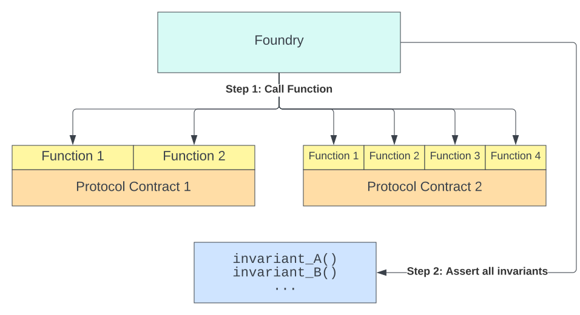
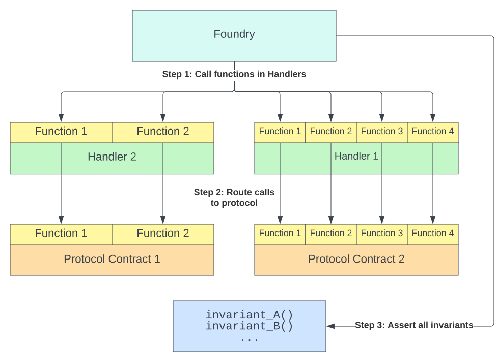

### Unlocking Deeper Security: An Introduction to Handler-Based Invariant Testing

In my previous article, we explored the fundamentals of invariant testing, a powerful technique for discovering bugs that traditional unit tests often miss. We learned that the core idea is to test a contract’s core properties (invariants) by feeding it a stream of randomized inputs. However, when applied to real-world, complex protocols, this approach can quickly hit a wall.

Today, we'll dive into a more advanced and effective strategy: **Handler-Based Testing**. This method addresses the shortcomings of traditional invariant testing and is essential for achieving a high level of security confidence in sophisticated systems.

---

### The Challenge of Open Invariant Testing

In a traditional or "open" invariant test, the Foundry fuzzer directly calls the public functions of the protocol's contracts. The goal is to see if any sequence of these calls can break an invariant.

The diagram below illustrates this model:



While effective for simple contracts, this approach often fails for complex protocols due to two key issues:

1. **Excessive Reverts:** Many protocol functions have strict prerequisites. For example, a `transfer` function requires the sender to have a sufficient token balance. A fuzzer calling these functions with entirely random inputs will lead to a flood of reverting transactions. The fuzzer spends most of its time hitting invalid states, leading to poor test coverage.
2. **Unrealistic Scenarios:** Without any guiding logic, the fuzzer's calls can be completely unrealistic. It might try to call `withdraw` before a user has made a `deposit`, for instance. This makes the test less meaningful for uncovering real-world vulnerabilities.

---

### The Solution: Handler-Based Testing

Handler-Based Testing solves these problems by introducing an intermediary layer called a **Handler**. The fuzzer no longer calls the protocol contracts directly; instead, it calls the functions of the Handler. The Handler, in turn, performs the necessary setup and then calls the protocol's functions in a controlled manner.

This model creates a far more meaningful and effective test campaign, as illustrated by the diagram below:



Here, the fuzzer's interactions are guided by the Handler's logic, ensuring that each function call to the protocol is valid and moves the system to a new, relevant state.

---

### Key Advantages of Handler-Based Testing

Leveraging handlers in your invariant testing strategy offers several significant benefits:

- **Fewer Reverts, Deeper Coverage:** By managing preconditions, handlers ensure that fuzzer calls are successful. This allows the test campaign to explore the deeper and more complex parts of the protocol's state machine, leading to better code coverage and a higher chance of finding subtle bugs.
- **Actor Management:** Handlers can simulate multiple actors (users) in the system. They can be configured to call functions on behalf of different addresses, mimicking a realistic, multi-user environment.
- **Ghost Variables:** Handlers can use "ghost variables"—state variables in the test environment that track off-chain metrics. For example, a handler can track the sum of all token balances and use this value to assert that the protocol's `totalSupply` invariant is never violated.
- **Bounded Inputs:** Handlers can use Foundry's `bound()` helper function to constrain fuzzer-generated inputs to a realistic range. This prevents the test from wasting time on values that would never occur on-chain.
- **Function-Level Assertions:** Handlers allow you to perform fine-grained assertions on state changes as they happen. You can check if a user's balance has decreased by the correct amount after a transfer, for example.

---

### A Simple Code Example with my Stablecoin Project

Now, let's use the code from my DeFi stablecoin project to demonstrate how Handler-Based Testing can effectively validate protocol invariants. In the project, `Handler.t.sol` simulates user actions, while `Invariants.t.sol` defines and checks the core properties of the system.

#### 1. The Handler Contract (`Handler.t.sol`)

This `Handler` contract is the primary target for the fuzzer. It contains public functions that mimic user interactions with the `DSCEngine` protocol, such as depositing collateral, redeeming it, and minting the stablecoin.

- **`depositCollateral()`**: This function simulates a user depositing collateral. It bounds the random `amountCollateral` to a reasonable size and then performs the necessary steps: minting the collateral, approving the `dsce` contract, and finally calling `dsce.depositCollateral()`. It also keeps track of which users have deposited collateral by adding them to the `usersWithCollateralDeposited` array.
- **`redeemCollateral()`**: This function handles collateral redemption. Before allowing the redemption, it performs a crucial check to ensure the user's health factor remains above the minimum threshold after the transaction. This prevents the fuzzer from executing transactions that would cause an invalid state and helps focus the test on valid protocol behaviors.
- **`mintDsc()`**: This function simulates a user minting the stablecoin. It first calculates the maximum amount of DSC a user can mint based on their collateral value and health factor. It then uses `bound()` to ensure the fuzzer's random `amount` is within this valid range, ensuring that every minting transaction is legitimate. It also increments a public `timesMintCalled` counter, a form of "ghost variable" that tracks this key operation.

```solidity
// Handler.t.sol

// SPDX-License-Identifier: MIT
pragma solidity ^0.8.18;
import {Test} from "forge-std/Test.sol";
import {DSCEngine} from "../../src/DSCEngine.sol";
import {DecentralizedStableCoin} from "../../src/DecentralizedStableCoin.sol";
import {IERC20} from "@openzeppelin/contracts/token/ERC20/IERC20.sol";
import {HelperConfig} from "../../script/HelperConfig.s.sol";
import {ERC20Mock} from
    "@chainlink/contracts/src/v0.8/vendor/openzeppelin-solidity/v4.8.3/contracts/mocks/ERC20Mock.sol";
import {MockV3Aggregator} from "../../test/mocks/MockV3Aggregator.sol";

contract Handler is Test {
    DSCEngine dsce;
    DecentralizedStableCoin dsc;

    ERC20Mock weth;
    ERC20Mock wbtc;

    uint256 public timesMintCalled;
    address[] public usersWithCollateralDeposited;
    MockV3Aggregator public ethUsdPriceFeed;
    // MockV3Aggregator public btcUsdPriceFeed;

    uint256 MAX_DEPOSIT_SIZE = type(uint96).max; // 2**96 -1

    constructor(DSCEngine _dscEngine, DecentralizedStableCoin _dsc) {
        dsce = _dscEngine;
        dsc = _dsc;

        address[] memory collateralTokens = dsce.getCollateralTokens();
        weth = ERC20Mock(collateralTokens[0]);
        wbtc = ERC20Mock(collateralTokens[1]);

        ethUsdPriceFeed = MockV3Aggregator(dsce.getCollateralTokenPriceFeed(address(weth)));
        // btcUsdPriceFeed = MockV3Aggregator(dsce.getCollateralTokenPriceFeed(address(wbtc)));
    }

    function depositCollateral(uint256 collateralSeed, uint256 amountCollateral) public {
        ERC20Mock collateral = _getCollateralFromSeed(collateralSeed);
        amountCollateral = bound(amountCollateral, 1, MAX_DEPOSIT_SIZE);

        vm.startPrank(msg.sender);
        collateral.mint(msg.sender, amountCollateral);
        collateral.approve(address(dsce), amountCollateral);
        dsce.depositCollateral(address(collateral), amountCollateral);
        vm.stopPrank();

        usersWithCollateralDeposited.push(msg.sender);
    }

    function redeemCollateral(uint256 collateralSeed, uint256 amountCollateral) public {
        ERC20Mock collateral = _getCollateralFromSeed(collateralSeed);
        uint256 maxCollateralToRedeem = dsce.getCollateralBalanceOfUser(msg.sender, address(collateral));
        amountCollateral = bound(amountCollateral, 0, maxCollateralToRedeem);
        if (amountCollateral == 0) {
            return;
        }

        // Calculate if this redemption would break the health factor
        (uint256 totalDscMinted, uint256 collateralValueInUsd) = dsce.getAccountInformation(msg.sender);
        // If user has no DSC minted, they can redeem all collateral
        if (totalDscMinted > 0) {
            uint256 collateralValueToRedeem = dsce.getUsdValue(address(collateral), amountCollateral);
            uint256 newCollateralValueInUsd = collateralValueInUsd - collateralValueToRedeem;

            // Calculate the new health factor
            uint256 newHealthFactor = dsce.calculateHealthFactor(totalDscMinted, newCollateralValueInUsd);
            // Only proceed if health factor would remain above minimum
            if (newHealthFactor < dsce.getMinHealthFactor()) {
                return;
            }
        }

        vm.startPrank(msg.sender);
        dsce.redeemCollateral(address(collateral), amountCollateral);
        vm.stopPrank();
    }

    function mintDsc(uint256 amount, uint256 addressSeed) public {
        if (usersWithCollateralDeposited.length == 0) {
            return;
        }
        address sender = usersWithCollateralDeposited[addressSeed % usersWithCollateralDeposited.length];

        (uint256 totalDscMinted, uint256 collateralValueInUsd) = dsce.getAccountInformation(sender);
        // Check for underflow before subtracting
        uint256 maxDscToMint;
        if (collateralValueInUsd / 2 <= totalDscMinted) {
            return;
        }
        maxDscToMint = (collateralValueInUsd / 2) - totalDscMinted;

        amount = bound(amount, 0, maxDscToMint);
        if (amount == 0) {
            return;
        }

        vm.startPrank(sender);
        dsce.mintDsc(amount);
        vm.stopPrank();

        timesMintCalled++;
    }

    // Helper Functions
    function _getCollateralFromSeed(uint256 collateralSeed) private view returns (ERC20Mock) {
        if (collateralSeed % 2 == 0) {
            return weth;
        } else {
            return wbtc;
        }
    }
}
```

#### 2. The Invariant Test Contract (`Invariants.t.sol`)

This contract defines the core invariants that I want to validate. It inherits from `StdInvariant`, which is Foundry's key base class for Invariant Testing.

- **`setUp()`**: This function deploys `DSCEngine` and `DecentralizedStableCoin` contracts. Crucially, it then deploys `Handler` contract and sets it as the target for the fuzzer (`targetContract(address(handler))`). This tells Foundry to call the public functions of the `Handler` instead of the protocol itself.
- **`invariant_protocolMustHaveMoreValueThanTotalSupply()`**: This is the first and most critical invariant. It checks that the total value of all collateral in the protocol is always greater than or equal to the total supply of your stablecoin. This is the fundamental property that prevents the protocol from becoming insolvent.
- **`invariant_getterShouldNotRevert()`**: This is an "evergreen" invariant that ensures all public view or pure functions do not revert under any circumstances. This is vital for a robust and predictable protocol.

```solidity
// Invariants.t.sol

// SPDX-License-Identifier: MIT
pragma solidity ^0.8.18;
import {Test, console} from "forge-std/Test.sol";
import {StdInvariant} from "forge-std/StdInvariant.sol";
import {DeployDSC} from "../../script/DeployDSC.s.sol";
import {DSCEngine} from "../../src/DSCEngine.sol";
import {DecentralizedStableCoin} from "../../src/DecentralizedStableCoin.sol";
import {HelperConfig} from "../../script/HelperConfig.s.sol";
import {IERC20} from "@openzeppelin/contracts/token/ERC20/IERC20.sol";
import {Handler} from "./Handler.t.sol";

contract Invariants is StdInvariant, Test {
    DeployDSC deployer;
    DSCEngine dsce;
    DecentralizedStableCoin dsc;
    HelperConfig config;
    address weth;
    address wbtc;
    Handler handler;

    function setUp() external {
        deployer = new DeployDSC();
        (dsc, dsce, config) = deployer.run();
        (,, weth, wbtc,) = config.activeNetworkConfig();
        // targetContract(address(dsce));
        handler = new Handler(dsce, dsc);
        targetContract(address(handler));
    }

    function invariant_protocolMustHaveMoreValueThanTotalSupply() public view {
        // get the value of all the collateral in the protocol
        // compare it to all the debt (totalSupply of DSC)
        uint256 totalSupply = dsc.totalSupply();
        uint256 totalWethDeposited = IERC20(weth).balanceOf(address(dsce));
        uint256 totalBtcDeposited = IERC20(wbtc).balanceOf(address(dsce));

        uint256 wethValue = dsce.getUsdValue(weth, totalWethDeposited);
        uint256 wbtcValue = dsce.getUsdValue(wbtc, totalBtcDeposited);
        console.log("weth value: ", wethValue);
        console.log("wbtc value: ", wbtcValue);
        console.log("total supply: ", totalSupply);
        console.log("Times mint called:", handler.timesMintCalled());
        assert(wethValue + wbtcValue >= totalSupply);
    }

    function invariant_getterShouldNotRevert() public view {
        dsce.getCollateralTokens();
        dsce.getCollateralBalanceOfUser(address(1), weth);
        dsce.getCollateralBalanceOfUser(address(1), wbtc);
        dsce.getHealthFactor(address(1));
        dsce.getLiquidationThreshold();
        dsce.getAccountInformation(address(1));
        dsce.getUsdValue(weth, 1e18);
        dsce.getUsdValue(wbtc, 1e8);
    }
}
```
