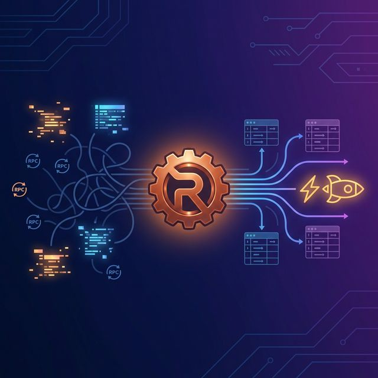

### The Story Begins: My Naive Approach

When I started building **[Neon Marketplace](https://github.com/LazyBoneJC/Neon-Marketplace)**, my NFT trading platform, I wanted to ship fast. Like most developers entering Web3, I reached for the familiar tools: Next.js on the frontend, wagmi for wallet connections, and direct RPC calls to Alchemy/Infura for fetching on-chain data.

Simple. Straightforward. And completely wrong for production.

It worked—at first. But as the project evolved and I started thinking about real users, the cracks became impossible to ignore.

---

### The Pain Points: Why Direct RPC Calls Don't Scale

Let me walk you through what I experienced:

#### 1. The N+1 Problem from Hell

To display a list of 10 NFTs with their details, I had to make:
- 10 calls to `ownerOf()`
- 10 calls to `tokenURI()`
- 10 calls to `getApproved()`
- Additional calls for marketplace listing data...

That's **30+ RPC calls** just to render one page. Each call hit Alchemy's servers, added latency, and ate into my free tier quota.

```javascript
// The naive approach - works, but painful
const nfts = await Promise.all(
  tokenIds.map(async (id) => {
    const owner = await contract.ownerOf(id);      // RPC call #1
    const uri = await contract.tokenURI(id);       // RPC call #2
    const approved = await contract.getApproved(id); // RPC call #3
    const metadata = await fetch(uri).then(r => r.json());
    return { id, owner, uri, approved, metadata };
  })
);
```

#### 2. Complex Queries? Forget About It

Users wanted to filter NFTs by price, sort by recent listings, search by attributes. Reasonable requests, right?

Here's the problem: **a blockchain is a linked list, not a database**.

There's no `SELECT * FROM nfts WHERE price < 1 ETH ORDER BY listed_at DESC`. To implement sorting and filtering, I would have to:
1. Fetch ALL listing events from the beginning of time
2. Process them in the browser
3. Watch the browser freeze with 10,000+ entries

The blockchain is a **ledger**, not a **query engine**. I was using it wrong.

#### 3. The 3-5 Second Loading Screen

Every page refresh meant waiting. And waiting. Users would stare at a spinner while dozens of RPC calls completed sequentially. In 2026, a 3-second load time feels like an eternity.

This wasn't just a minor inconvenience—it was a fundamental UX disaster.

---

### The Mindset Shift: Enter the Indexer

The realization hit me: **I needed a middleman**.

Instead of querying the blockchain directly, I needed a service that would:
1. **Listen** to on-chain events in real-time
2. **Transform** raw blockchain data into structured records
3. **Store** everything in a traditional database (hello, PostgreSQL)
4. **Serve** lightning-fast queries through a familiar API

```
Before:
Client → RPC Node (slow, expensive, limited queries)

After:
Client → My Backend API → PostgreSQL ← Indexer ← RPC Node
```

This architecture shift is the difference between "technically functional" and "production-ready."

---

### Tool Selection: Why Rindexer Won

I evaluated several options:

| Option | Pros | Cons |
|--------|------|------|
| **Custom Node.js Script** | Familiar tech, full control | Must handle reorgs, reconnection, retries manually |
| **The Graph** | Decentralized, battle-tested | Steep learning curve (GraphQL, AssemblyScript), less control |
| **Rindexer** | Rust performance, YAML config, built-in reorg handling | Newer tool, smaller community |

Given my background in Node.js/RabbitMQ, I initially leaned toward building a custom solution. But I quickly realized I'd be spending weeks handling edge cases:

- **Chain reorganizations (reorgs)**: When the blockchain "undoes" recent blocks
- **RPC connection drops**: Long-running processes need robust reconnection logic  
- **Backfilling historical data**: Processing months of past events without crashing

Rindexer handles all of this out of the box. Plus, it's written in Rust—compiled to a single binary with excellent memory safety and performance characteristics. For a long-running backend service, these properties matter.

---

### Understanding Rindexer: The Architecture

Rindexer follows a simple but powerful pipeline:

```
┌──────────────────┐    ┌──────────────────┐    ┌──────────────────┐
│   RPC Node       │ →  │    Rindexer      │ →  │   PostgreSQL     │
│ (Event Source)   │    │ (Fetch + Decode) │    │ (Queryable DB)   │
└──────────────────┘    └──────────────────┘    └──────────────────┘
         ↑                       │                        │
         │                       ↓                        ↓
    Blockchain           YAML Configuration        GraphQL API
                        (Define what to index)    (Auto-generated)
```

#### Step 1: Define What to Index (YAML)

No Rust code required for basic use cases. Just YAML:

```yaml
name: NeonMarketplaceIndexer
description: Indexer for Neon NFT Marketplace
project_type: no-code

networks:
  - name: base
    chain_id: 8453
    rpc: https://base.gateway.tenderly.co

storage:
  postgres:
    enabled: true

contracts:
  - name: NeonNFT
    details:
      - network: base
        address: "0x1234...your-contract-address"
        start_block: "12345678"
    abi: ./abis/NeonNFT.json
    include_events:
      - Transfer
      - Approval
      - Listed
      - Sold
```

That's it. Rindexer reads your ABI, understands the event signatures, and automatically creates corresponding PostgreSQL tables.

#### Step 2: Automatic Schema Generation

When you run `rindexer start`, it:
1. Connects to your PostgreSQL instance
2. Creates tables matching your event structures
3. Starts fetching logs using `eth_getLogs` (batch requests, not one-by-one)
4. Decodes the hex data using your ABI
5. Inserts structured records into Postgres

No manual schema design. No custom parsers. It just works.

#### Step 3: Reorg Handling (The Critical Feature)

Here's where Rindexer really shines. Blockchain reorganizations are inevitable—especially on L2s with faster block times.

When a reorg happens, Rindexer detects it and **automatically rolls back** the affected records from your database. This ensures your local database maintains **eventual consistency** with the canonical chain.

```yaml
contracts:
  - name: NeonNFT
    details:
      - network: base
        address: "0x1234..."
        start_block: "12345678"
    reorg_safe_distance: true  # Enable reorg safety
```

The `reorg_safe_distance` option keeps a safe distance from the chain tip to minimize reorg exposure. For more advanced scenarios, Rindexer's ExEx integration with Reth nodes provides native reorg notifications:

```rust
// Under the hood, Rindexer handles these notifications
Reorged {
    revert_from_block: 19000098,
    revert_to_block: 19000100,
    new_from_block: 19000098,
    new_to_block: 19000101,
    new_tip_hash: 0x456...
}
```

I didn't have to write any of this logic. That's weeks of development time saved.

---

### The Results: From 3 Seconds to 300 Milliseconds

With the indexing layer in place, everything changed:

| Metric | Before (Direct RPC) | After (Indexed) | Improvement |
|--------|---------------------|-----------------|-------------|
| NFT list load time | 3-5 seconds | 200-300ms | **~10x faster** |
| Complex filtering | Browser freeze | Instant | **Usable** |
| API quota usage | 1000s of calls/min | ~10 calls/min | **99% reduction** |

Queries that were impossible before became trivial:

```sql
-- Get latest 20 listed NFTs under 0.5 ETH
SELECT * FROM neon_nft_listed
WHERE price < 500000000000000000  -- 0.5 ETH in wei
ORDER BY block_number DESC
LIMIT 20;
```

With proper B-tree indexes on the price and block_number columns, this query returns in **single-digit milliseconds**.

---

### Bonus: Enabling Compliance

Here's something I didn't anticipate: having data in my own database unlocked compliance capabilities.

For Neon Marketplace, I integrated **Circle's Compliance API** to screen wallet addresses before displaying transaction history. This wouldn't be possible with direct RPC calls—you can't filter blockchain data by external compliance lists.

```javascript
// Pseudo-code for compliance-aware API
async function getListings(userId) {
  const listings = await db.query('SELECT * FROM listings ORDER BY created_at DESC');
  
  // Screen seller addresses against compliance API
  const screenedListings = await Promise.all(
    listings.map(async (listing) => {
      const isClean = await circleComplianceCheck(listing.seller);
      return isClean ? listing : null;
    })
  );
  
  return screenedListings.filter(Boolean);
}
```

This is only possible when **you** control the data layer.

---

### Lessons Learned

Building Neon Marketplace taught me several valuable lessons:

1. **Don't treat blockchain as a database**  
   It's a ledger. Respect its purpose and build the right abstractions.

2. **Choose tools, don't build everything**  
   I could have spent months building a custom indexer. Instead, I picked Rindexer and shipped features that actually matter to users.

3. **Rust tooling is ready for production**  
   The Web3 ecosystem is increasingly Rust-first (Reth, rindexer, Foundry). Learning to leverage these tools gives you significant advantages.

4. **Local data unlocks possibilities**  
   Compliance, analytics, caching, complex queries—all become possible when you own your data layer.

---

### What's Next?

Rindexer continues to evolve. Features I'm excited about:

- **Reth ExEx Integration**: Direct access to node memory for zero-RPC-overhead indexing
- **Kafka/RabbitMQ Streaming**: Real-time event notifications for reactive architectures
- **Multi-chain Indexing**: Index multiple networks with a single configuration

For now, my Neon Marketplace runs smoothly with a simple setup:

```
Next.js Frontend → Express.js API → PostgreSQL ← Rindexer ← Base RPC
```

Clean. Fast. Maintainable.

---

### Conclusion

Moving from direct RPC calls to an indexed architecture wasn't just a performance optimization—it was a fundamental shift in how I think about Web3 application development.

The blockchain is your source of truth. But for a great user experience, you need a **query layer** between your users and the chain. Tools like Rindexer make this accessible without requiring you to become a database expert or Rust developer.

If you're building a dApp and finding yourself frustrated with slow load times or limited query capabilities, consider building your own indexing layer. Your users (and your RPC quota) will thank you.

---

*Want to see the code? Check out the [Neon Marketplace repository](https://github.com/LazyBoneJC/Neon-Marketplace) on GitHub. Feel free to connect with me on [LinkedIn](https://linkedin.com/in/yu-wei-chang-6714a91a4) to discuss Web3 architecture patterns.*
